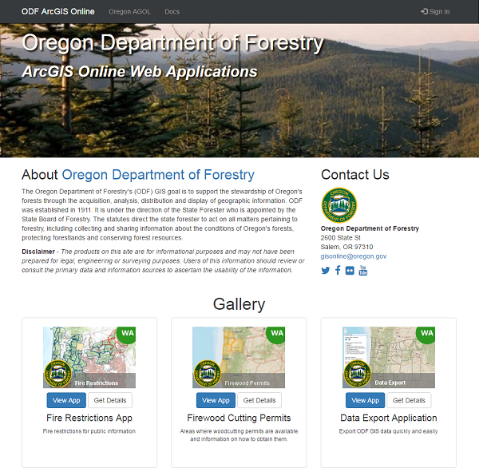

# ArcGIS Online Sub-Organization Home Pages

## Create By:  State of Oregon [Geospatial Enterprise Office](http://geo.maps.arcgis.com/home/index.html)

### About

Oregon has a single ArcGIS Online account with many different agencies, each creating mapping
applications with an immeasurable benefit to the public.  Sub-Organization home
pages give every agency the ability to present their efforts in an attractive landing page.  The
site is fully responsive and looks great on mobile and tablet devices.  You can view
a list of our currently configured agency home pages through the links on our
[ArcGIS Online page](http://geo.maps.arcgis.com/), or view them directly
[here](http://navigator.state.or.us/agol/).

### Screenshots

Landing page for the Oregon Department of Forestry



### Getting Started

This project has a fully operating [client](./client) and [server](./server) example
for you to get started.  The main requirement for building the application and running
the server is NodeJS:

+ [NodeJS](https://nodejs.org/en/) and NPM

The two primary directories `./client` and `./server` have their own `package.json`
file which defines their dependencies.  I like to have two terminals (command prompt) open for
running both the client and server at the same time.

+ *Terminal 1* - Install server dependencies

```
cd server
npm install
```

+ *Terminal 1* - Run Express App

```
node server.js
```

Your simple server should now be available at [http://127.0.0.1:4370/](http://127.0.0.1:4370/).

You can test getting the result for a single agency with the query parameter
`agencyName`: example [http://127.0.0.1:4370/API?agencyName=GEO](http://127.0.0.1:4370/API?agencyName=GEO)

Next, we will build and launch our client app.  Open a second terminal and follow
these steps:

+ *Terminal 2* Install client dependencies

```
cd client
npm install
```

This application was built with help from a ReactJS build tool that has everything
configured to jump into a project without messing with your own build configuration. 

Read more about the tool, [create-react-app](https://github.com/facebookincubator/create-react-app). 

All of the commands available to this tool are available in this directory.  I recommend reading more
if you are stuck.

+ *Terminal 2* Launch Client App

```
npm start
```

You're application should now be available at [http://127.0.0.1:3000](http://127.0.0.1:3000).

WooHoo!!

### Configuration / Development

You can configure most of the application in the [./client/src/config.js](./client/src/config.js) file.
This setup should be self-explanatory, but I will add documentation as this project develops.

If you are a fan of modular development, you should really like this project.  It uses [ReactJS](https://facebook.github.io/react/)
to build all of the UI components, and makes it easy for you to add / remove / create new UI
components as you feel necessary.

### Deploying to Production

You're production build will vary depending on what environment you are deploying to.  Our app
is deployed on IIS, so there are are couple of things needed to make it work.  Below are the
steps we take to deploy our app to production. **Note: You will need to develop your own server
backend for delivering the configs.  It can be simple, like the express app, but you probably
want to create a way for your agencies to edit their config files by logging in.  You can also modify
this project to use static files rather than a service.  Our initial creation of this project used static
files that were stored in ArcGIS Online.**

+ Update the *serverConfig* object `./client/config.js` to point to your hosted service
+ Update the *homepage* property in `./client/package.json` to the relative path of your production project

Since we are deploying to IIS, you will need to have [URL_REWRITE](https://www.iis.net/downloads/microsoft/url-rewrite)
installed.  Our `web.config` setup for most IIS environments is already provided in `./client/public/web.config`.

After all these are done, you can build your production code using the following command:

```
npm run build
```

Now, deploy the code in your `./client/build/` folder to your production environment.

### License

Licensed under the GNU GENERAL PUBLIC LICENSE, Copyright (C) 2016 State of Oregon
Geospatial Enterprise Office

See [LICENSE](./LICENSE) for detailed information.

### Acknowledgements

This projects builds on the incredible work being done at [Esri](http://www.esri.com/)
with ArcGIS Online, and many thanks to the many projects that helped make this app
possible:

+ [ArcGIS Online](http://www.esri.com/)
+ [ReactJS](https://github.com/facebook/react)
+ [create-react-app](https://github.com/facebookincubator/create-react-app)
+ [React-Bootstrap](https://react-bootstrap.github.io/)

And I cannot forget to acknowledge the supportive and creative staff here at the
[Oregon Geospatial Enterprise Office](http://geo.maps.arcgis.com/home/index.html).
**Thank You Team!!**
